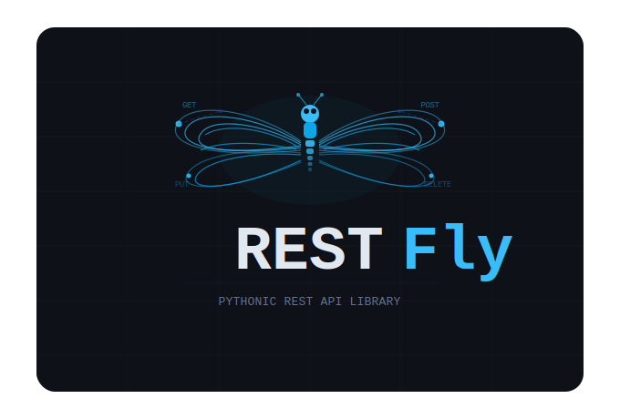
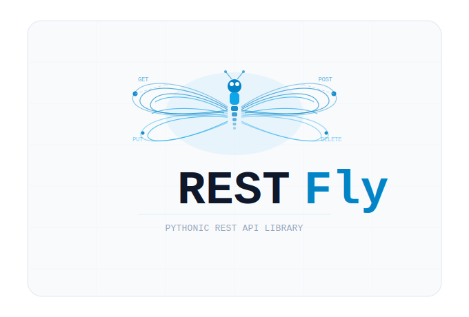

What is RESTFly?
----------------

Building API SDKs can be often be difficult.  There is often a lot of boilerplate code
that is reused over and over again between classes, packages, and even libraries.
RESTFly is designed to try to remove as much of that boilerplate code as possible. The
library leverages HTTPX and Pydantic in the backend to support making interacting with
the API endpoints themselves simple, as well as supporting the ability to marshal and
unmarshal the data between python objects and XML or JSON.

Version 2 of RESTFly is a ground-up rewrite in order to support a more modern developer
experience when working with the library.

* Completely rewritten to use HTTPX instead of Requests
* Support for both synchronous and asynchronous clients.
* Significantly better typing support, which should make both AI Agents and devs happy.
* Support for coercion of data to/from Pydantic and Pydantic-XML models.
* Improved endpoint grafting (no more ``@property`` methods for each endpoint).
* Batteries-included error handling and retry logic.
* Designed to be heavily modified based on your particular needs.

Why RESTFly?
------------

After building several SDKs over the years, I wanted something that could abstract away
a lot of the boilerplate code that I kept having to write over and over.  RESTFly
version 1 ended up being nearly a direct port of what I had built with pyTenable back
in 2017 and expanded since then.  Over time, pyTenable was refactored to itself leverage
RESTFly, and several other SDKs started taking advantage of RESTFly as well. For
version 2, I wanted to incorporate a lot more of the modern Python approaches and also
incorporate a lot of the idioms that I've grown used to with libraries like
FastAPI, Pydantic, AsyncIO, etc.  I also didn't want to have to keep diving into the
documentation every time I needed something when more and more libraries were supporting
type hints to aide developers within their SDKs.

.. toctree::
   :maxdepth: 2

   userguide
   reference
   GitHub <https://github.com/librestfly/restfly>
   File an Issue <https://github.com/librestfly/restfly/issues>
   Examples <https://github.com/librestfly/restfly/tree/main/examples>
